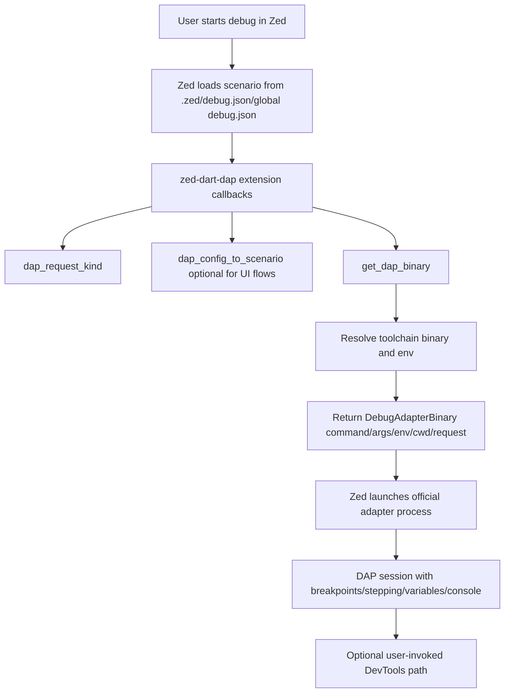

# zed-dart-dap Design

## Overview
`zed-dart-dap` is a Rust-native Zed debugger extension that provides full-featured debugging for Dart CLI apps, Flutter apps, and tests by reusing official toolchain Debug Adapter Protocol servers instead of implementing a custom Dart VM debugger.

The extension is optimized for macOS in v1 (officially tested), while Linux/Windows support is experimental. The extension is designed for robust behavior and low bug risk, with zero known blocker/critical issues at release and regression coverage for core flows.

DevTools behavior is manual-only in v1: no automatic browser opening.

## Detailed Requirements
1. Primary goal
- Support debugging for Dart CLI apps, Flutter apps, and tests.

2. Users and platform targets
- Target users: Zed extension users.
- Priority platform: macOS.
- Linux/Windows supported as experimental in v1.

3. Mandatory debug workflows in v1
- Launch.
- Attach.
- Breakpoints.
- Step in/out/over.
- Variable inspection.
- Watch expressions.
- Call stack.
- Debug console.

4. DevTools expectations
- DevTools must not auto-open.
- Users trigger DevTools explicitly from Zed UI/command path.

5. Scope
- No explicit feature exclusions for v1.
- Full-feature target across common and advanced flows where supported by official adapters.

6. Zed workspace/config model
- Use per-worktree `.zed/debug.json`.
- Support global `debug.json` presets merged by Zed.
- Do not target VS Code multi-root workspace launch semantics.

7. Success criteria
- Default templates should work for most Dart/Flutter/test projects without manual edits.
- Robust behavior and low bug rate are prioritized over setup-time metrics.
- Release quality requires zero known blocker/critical bugs and automated regression coverage for core flows.

8. Toolchain policy
- No FVM support in v1.
- Compatibility window: latest stable Dart/Flutter plus previous 3 stable releases.
- Official CI verification on macOS; Linux/Windows are non-CI experimental.

9. Runtime architecture direction
- Reuse official adapter behavior/tooling.
- Implement Zed integration as Rust-native extension only (no Node/TypeScript bridge).

10. Failure handling expectation
- Missing/misconfigured SDK conditions should be logged with diagnostic detail for debugging.

## Architecture Overview
The extension delegates debug protocol semantics to official adapters and focuses on deterministic adapter selection, config translation, path/environment resolution, and stable process launch.



Adapter process mapping:
- Dart app: `dart debug_adapter`
- Dart test: `dart debug_adapter --test`
- Flutter app: `flutter debug-adapter`
- Flutter test: `flutter debug-adapter --test`

## Components and Interfaces
1. Extension Entrypoint (`Extension` trait implementation)
- Implements `get_dap_binary`.
- Implements `dap_request_kind`.
- Implements `dap_config_to_scenario` for better New Debug Session UX.

2. Config Translator
- Converts Zed generic debug config into adapter-specific JSON payload.
- Normalizes defaults for launch/attach.
- Validates required fields before returning low-level adapter config.

3. Adapter Resolver
- Maps logical target type (`dart`, `flutter`, test modes) to command/args.
- Applies `--test` mode deterministically.

4. Toolchain Locator
- Resolves binaries from worktree (`which`) and shell environment.
- Applies explicit configured override paths when provided.
- Captures resolution details for diagnostics logging.

5. Debug Binary Builder
- Produces `DebugAdapterBinary` with:
  - `command`
  - `arguments`
  - `envs`
  - `cwd`
  - `request_args`

6. Diagnostics Logger
- Emits structured logs for:
  - binary resolution
  - scenario normalization
  - adapter launch parameters (safe subset)
  - failures and exit conditions

7. DevTools Coordinator (manual path)
- Consumes VM service availability signals from debug session context.
- Exposes manual invocation path (user action) only.
- Never auto-opens browser.

Assumption A1:
- If current Zed extension APIs do not expose a first-class extension command action for debugger sessions, v1 manual DevTools UX falls back to a deterministic log/copy URL flow until host command hooks are available.

## Data Models
1. Debug scenario model (user-facing `.zed/debug.json`)
```json
[
  {
    "label": "Flutter: Launch App",
    "adapter": "DartFlutter",
    "request": "launch",
    "program": "lib/main.dart",
    "cwd": "$ZED_WORKTREE_ROOT",
    "args": [],
    "env": {}
  },
  {
    "label": "Dart: Attach via VM Service",
    "adapter": "DartCLI",
    "request": "attach",
    "vmServiceUri": "ws://127.0.0.1:12345/abcd=/ws"
  }
]
```

2. Internal normalized target kind
- `dart_launch`
- `dart_attach`
- `dart_test_launch`
- `flutter_launch`
- `flutter_attach`
- `flutter_test_launch`

3. Adapter launch descriptor (internal)
- `command: String`
- `args: Vec<String>`
- `env: Map<String, String>`
- `cwd: Option<String>`
- `request_kind: Launch|Attach`
- `config_json: String`

4. Diagnostics event model
- `timestamp`
- `event_type` (`tool_resolve`, `config_validate`, `adapter_launch`, `adapter_exit`, `devtools_manual_trigger`)
- `platform`
- `target_kind`
- `message`
- `metadata` (safe, non-secret)

## Error Handling
1. Configuration errors
- Invalid/missing required fields return adapter startup failure with clear reason.
- Log category: `config_validate`.

2. Toolchain resolution failures
- Missing `dart`/`flutter` binary or unusable path returns immediate failure.
- Log category: `tool_resolve`.

3. Adapter startup failures
- Non-zero startup/early exit from official adapter is surfaced as debug session failure.
- Log category: `adapter_launch`/`adapter_exit`.

4. Attach-mode failures
- Invalid VM service URI / unreachable endpoint fails attach with logged diagnostics.

5. DevTools manual-flow failures
- If no active debug session/VM service is present, emit explicit user-facing reason and debug log.
- No automatic retries/open-browser side effects.

6. Experimental platform behavior
- Linux/Windows platform-specific failures are logged and documented as experimental limitations.

## Acceptance Criteria
1. Dart CLI launch
- Given a Dart CLI project with a valid main entrypoint
- When the user starts the default Dart launch template in Zed
- Then a debug session starts and supports breakpoints, stepping, variable inspection, watch, call stack, and debug console.

2. Dart attach
- Given a running Dart process with VM service enabled
- When the user starts an attach template with valid VM service info
- Then the session attaches successfully and core debugging features function.

3. Flutter launch
- Given a Flutter app project on macOS with working Flutter SDK
- When the user starts the default Flutter launch template
- Then the app launches under debug and core debugging features function.

4. Flutter test debug
- Given a Flutter project with tests
- When the user starts the Flutter test template
- Then tests execute under debug with breakpoint and stepping support.

5. Template usability
- Given a typical Dart or Flutter project
- When the user uses shipped default templates without edits
- Then at least one relevant debug flow starts successfully.

6. DevTools manual-only behavior
- Given an active debug session
- When the user does not trigger DevTools
- Then DevTools is never auto-opened.

7. DevTools explicit trigger
- Given an active debug session with VM service available
- When the user invokes the DevTools action path
- Then DevTools endpoint info is surfaced and the configured manual path is executed.

8. macOS support guarantee
- Given supported toolchain versions on macOS
- When CI and integration tests run
- Then all core launch/attach workflows pass.

9. Experimental Linux/Windows declaration
- Given Linux or Windows usage
- When users run debug workflows
- Then functionality may work but is clearly labeled experimental and not CI-guaranteed.

10. Release quality gate
- Given a release candidate
- When triaging known issues
- Then no blocker/critical bugs remain open.

## Testing Strategy
1. Unit tests (Rust)
- Target-kind mapping to command/args.
- Request-kind derivation.
- Config normalization and schema validation.
- Toolchain path resolution precedence and edge cases.

2. Contract tests
- Validate generated `DebugAdapterBinary` objects against expected values.
- Snapshot tests for normalized config outputs per template.

3. Integration tests (macOS CI)
- Dart launch/attach/test against fixture projects.
- Flutter launch/test against fixture projects.
- Core debugging interaction checks (breakpoint hit, step, evaluate expression).

4. Reliability/regression suite
- Repeat-session tests (start/stop cycles).
- Concurrent session sanity where supported.
- Failure-path tests for missing SDK/broken config.

5. Compatibility matrix execution
- macOS CI lanes for latest stable + previous 3 stable toolchain releases.
- Linux/Windows non-blocking smoke jobs (if infrastructure exists) marked informational.

6. Manual exploratory checks
- DevTools manual trigger behavior (no auto-open).
- Logging quality and diagnosability for startup failures.

## Appendices
### A. Technology Choices
- Rust-native Zed extension API.
- Official Dart and Flutter SDK debug adapters.
- Zed `debug.json`-based scenario model.

### B. Research Findings Summary
- Zed extension debugger APIs support required adapter launch contracts.
- Official Dart/Flutter adapters already cover core debugging semantics.
- DevTools protocols are available from toolchains, but extension-host action ergonomics in Zed may constrain direct command-style UX.

### C. Alternative Approaches Considered
1. Custom Dart DAP server from scratch
- Rejected: high complexity and maintenance risk versus official adapters.

2. Node/TypeScript bridge runtime
- Rejected: contradicts Rust-native requirement and increases runtime surface.

3. Automatic DevTools opening
- Rejected: conflicts with explicit manual-trigger requirement.

4. FVM support in v1
- Rejected: explicitly out of v1 scope per requirements.

### D. Risks and Mitigations
1. Risk: Zed action API limitations for extension-defined debugger commands.
- Mitigation: implement manual deterministic fallback UX and keep architecture ready for host command integration.

2. Risk: toolchain behavior variance across SDK versions.
- Mitigation: version-window CI matrix and adapter launch contract tests.

3. Risk: platform-specific process/env differences on experimental OSes.
- Mitigation: explicit experimental labeling and targeted smoke coverage.
