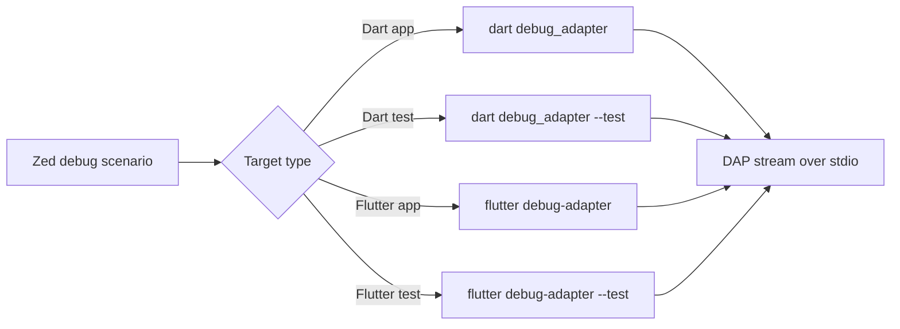

# Research: Official Dart/Flutter DAP Behavior

## Scope
Determine the official debug adapter entrypoints and behaviors `zed-dart-dap` should reuse.

## Key Findings
- Dart SDK provides official DAP servers via:
  - `dart debug_adapter`
  - `dart debug_adapter --test`
- Flutter tool provides official DAP servers via:
  - `flutter debug-adapter` (alias: `debug_adapter`)
  - `flutter debug-adapter --test`
- Flutter's adapter is intended for DAP clients and is single-session in lifecycle (spawn per debug session).
- Flutter adapter extends standard Dart DAP behavior with Flutter-specific functionality (for example hot reload/hot restart requests).
- Existing Dart tooling (Dart-Code) launches SDK adapters directly as subprocesses using `debug_adapter` and appends `--test` for test sessions.

## Implications for zed-dart-dap
- Reusing official adapters is viable and aligned with upstream toolchain contracts.
- `zed-dart-dap` can map adapter modes directly:
  - Dart CLI launch/attach -> `dart debug_adapter`
  - Dart test -> `dart debug_adapter --test`
  - Flutter app launch/attach -> `flutter debug-adapter`
  - Flutter test -> `flutter debug-adapter --test`
- Session lifecycle should remain adapter-per-session rather than long-lived shared adapter daemons.

## Diagram

## Sources
- https://github.com/dart-lang/sdk/blob/main/third_party/pkg/dap/tool/README.md
- https://github.com/flutter/flutter/blob/main/packages/flutter_tools/lib/src/debug_adapters/README.md
- https://github.com/flutter/flutter/blob/main/packages/flutter_tools/lib/src/commands/debug_adapter.dart
- https://github.com/Dart-Code/Dart-Code/blob/master/src/extension/providers/debug_adapter_descriptor_factory.ts
