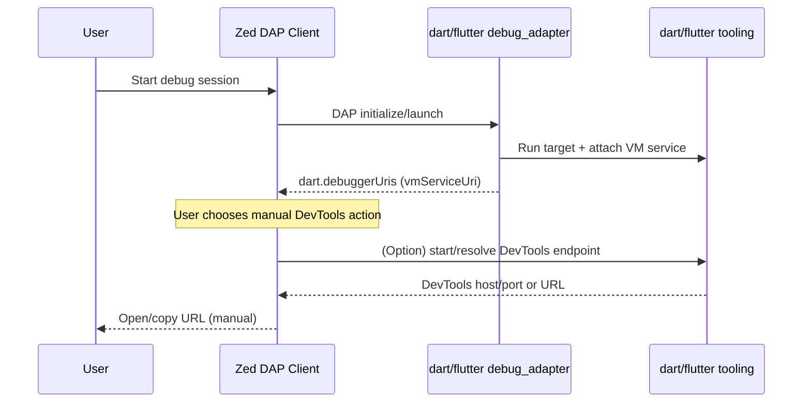

# Research: DevTools Integration Path

## Scope
Identify practical ways for `zed-dart-dap` to support user-invoked DevTools (not auto-open), based on official Dart/Flutter tooling and current Zed extension APIs.

## Key Findings
- Dart debugging surfaces VM Service connection data through the `dart.debuggerUris` custom event (includes `vmServiceUri`).
- Dart tooling officially supports `dart devtools`, and Dart docs show DevTools URLs can be derived from a running debug/observe session.
- Flutter daemon protocol exposes `devtools.serve`, returning host/port for a DevTools server.
- Flutter daemon protocol also includes `app.exposeUrl` (for remote/web URL mapping scenarios) when enabled.
- The VS Code Dart extension treats DevTools as a user-triggered command (`dart.openDevTools`) and only auto-opens based on settings; this is a strong reference behavior for your "manual invocation" requirement.
- Zed extension docs/APIs currently document debugger adapters, locators, and slash commands, but do not document a general extension-defined command palette action API.
- Zed extension WIT APIs expose subprocess execution (`run-command`) but do not expose a direct "open URL in browser" API.

## Inference (explicit)
From current published Zed extension APIs/docs, implementing a first-class command-palette action like `Dart: Open DevTools` entirely inside the extension may require additional Zed host support.

## Implications for zed-dart-dap
- Keep DevTools user-invoked (matches requirement) and avoid automatic browser opening.
- Use official runtime signals (`dart.debuggerUris` / VM service URI) as the canonical source for DevTools session linkage.
- Plan v1 DevTools support as one of:
  - "manual URL path" (capture/log URL/VM service URI for users), or
  - host-supported action when Zed exposes extension command/action hooks for debugger sessions.
- Treat advanced remote/web URL exposure as future work unless Zed exposes equivalent forwarding hooks.

## Diagram

## Sources
- https://github.com/dart-lang/sdk/blob/main/third_party/pkg/dap/tool/README.md
- https://dart.dev/tools/dart-devtools
- https://github.com/flutter/flutter/blob/main/packages/flutter_tools/doc/daemon.md
- https://github.com/Dart-Code/Dart-Code/blob/master/src/extension/commands/debug.ts
- https://github.com/Dart-Code/Dart-Code/blob/master/src/extension/sdk/dev_tools/manager.ts
- https://zed.dev/docs/extensions/developing-extensions
- https://zed.dev/docs/extensions/debugger-extensions
- https://zed.dev/docs/extensions/slash-commands
- https://github.com/zed-industries/zed/blob/main/crates/extension_api/wit/since_v0.8.0/extension.wit
- https://github.com/zed-industries/zed/blob/main/crates/extension_api/wit/since_v0.8.0/process.wit
