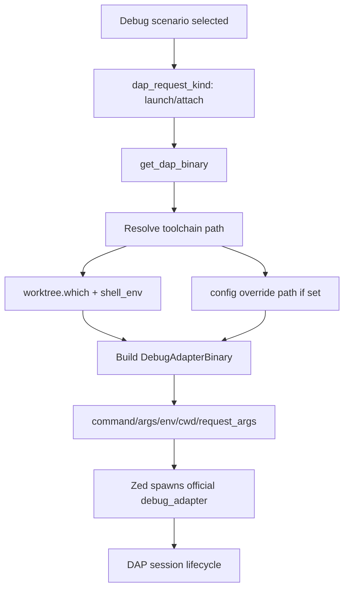

# Research: Rust-Native Runtime and Process Architecture

## Scope
Define a Rust-only extension runtime shape for `zed-dart-dap` that launches official Dart/Flutter adapters directly and respects current Zed extension constraints.

## Key Findings
- Zed debugger extensions are expected to provide `get_dap_binary`, `dap_request_kind`, and optionally `dap_config_to_scenario`.
- `get_dap_binary` is session-time critical and should avoid expensive per-launch work.
- Zed's `debug-adapter-binary` contract supports all required launch controls: `command`, `arguments`, `envs`, `cwd`, and request args.
- Worktree APIs provide `which(binary)` and `shell_env()`, enabling robust binary discovery and environment propagation.
- Extension subprocess API (`run-command`) is synchronous (waits for process completion); it is useful for probes/validation, not for long-lived sidecar daemons.
- Extensions are prevented from changing global CWD directly; any working directory control should be applied through returned process fields (`cwd`) rather than process-global `chdir`.

## Recommended Runtime Shape (v1)
- Keep extension runtime Rust-only.
- Resolve adapter command per session using deterministic mapping:
  - Dart app: `dart debug_adapter`
  - Dart test: `dart debug_adapter --test`
  - Flutter app: `flutter debug-adapter`
  - Flutter test: `flutter debug-adapter --test`
- Use worktree `which()` + `shell_env()` first; apply explicit config overrides when provided.
- Return clear diagnostics in logs for tool resolution and launch arguments.
- Keep macOS as tested platform in CI; mark Linux/Windows behavior as experimental (best effort, no CI guarantees).

## Compatibility Policy Fit
- Your requested policy (latest stable + previous 3 releases) should be implemented as a tested support window, not hardcoded version constants in the extension binary.
- Runtime should tolerate newer toolchains unless a known incompatible behavior is detected.

## Diagram

## Sources
- https://zed.dev/docs/extensions/debugger-extensions
- https://github.com/zed-industries/zed/blob/main/crates/extension_api/src/extension_api.rs
- https://github.com/zed-industries/zed/blob/main/crates/extension_api/wit/since_v0.8.0/dap.wit
- https://github.com/zed-industries/zed/blob/main/crates/extension_api/wit/since_v0.8.0/extension.wit
- https://github.com/zed-industries/zed/blob/main/crates/extension_api/wit/since_v0.8.0/process.wit
- https://github.com/zed-industries/zed/blob/main/crates/debug_adapter_extension/src/extension_dap_adapter.rs
