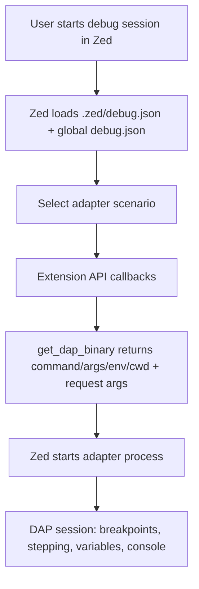

# Research: Zed Debugger Extension Constraints

## Scope
Understand what Zed currently supports for debugger extensions and what hard constraints affect `zed-dart-dap` v1 design.

## Key Findings
- Zed is a DAP client and expects a debug adapter process to implement the server side of DAP.
- Debug configs are normally defined in `.zed/debug.json` (array of scenarios). Zed also supports global `debug.json` presets merged into each workspace.
- Zed only falls back to `.vscode/launch.json` when `.zed/debug.json` has no configurations.
- Zed does not support VS Code-style multi-root workspaces (`.code-workspace`); one folder maps to one workspace.
- A debugger extension must register adapters in `extension.toml` under `[debug_adapters.<name>]`, and a JSON schema is required.
- Extension-side debugger entry points are `get_dap_binary`, `dap_request_kind`, and (recommended) `dap_config_to_scenario`; optional locators can create scenarios from tasks.
- The extension API's `debug-adapter-binary` model directly supports `command`, `arguments`, `envs`, and `cwd`, which is sufficient for a Rust extension to launch toolchain binaries without Node.

## Implications for zed-dart-dap
- v1 should treat `.zed/debug.json` + global `debug.json` as first-class configuration surfaces.
- Multi-root launch config parity with VS Code should be explicitly out of architecture scope (matches your requirements).
- A Rust-only extension can return toolchain launch commands directly through `get_dap_binary`.
- A strict schema per adapter is mandatory, so config contract design must be done early.

## Diagram

## Sources
- https://zed.dev/docs/debugger.html
- https://zed.dev/docs/extensions/debugger-extensions.html
- https://zed.dev/docs/extensions/developing-extensions.html
- https://zed.dev/docs/migrate/vs-code.html
- https://github.com/zed-industries/zed/blob/main/crates/extension_api/wit/since_v0.8.0/dap.wit
- https://github.com/zed-industries/zed/blob/main/crates/extension_api/src/extension_api.rs
